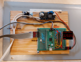

# Pico Hardware

This folder contains all the necessary hardware configurations and schematics to get your Flipdot display up and running with a Raspberry Pi Pico. It is WIP for now, but there is already a pinout diagram that could be useful.

## Pinout Diagram

Below is the pinout diagram for connecting your Raspberry Pi Pico to the Flipdot display:

Make sure to follow the pinout diagram carefully to ensure proper connections and functionality.

## Schematic

There is also a [Schematic](./schematic_rev1.pdf) of the PCB, with the corresponding KiCad project files.
